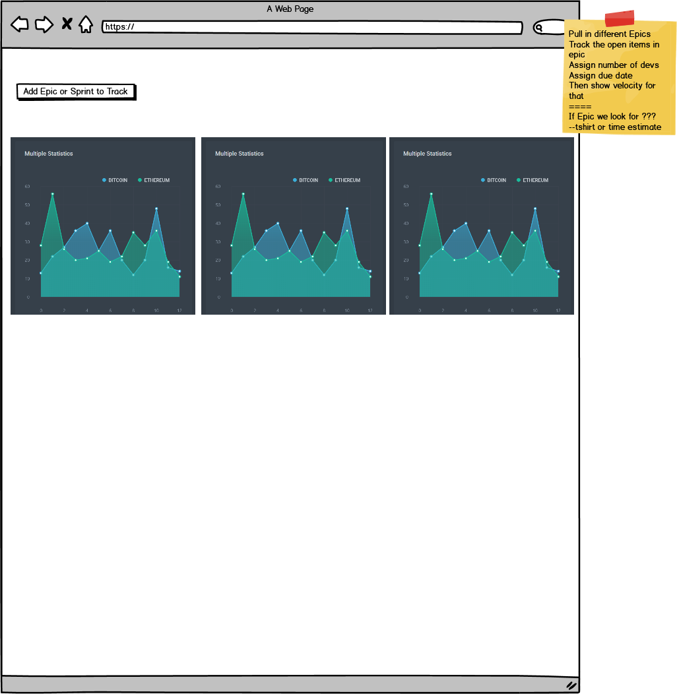

## Dashboard

Attempt 103 to get a decent dashboard for JIRA

## TODO 

  [] Add new Epic or Story
  [] Initial import of that Epic and its tickets
  [] Ability to snyc to get latest status of tickets, title etc
  [] Epic should have number_devs, due_date etc so need to add at start and edit these somehow
  [] um why is git push not working